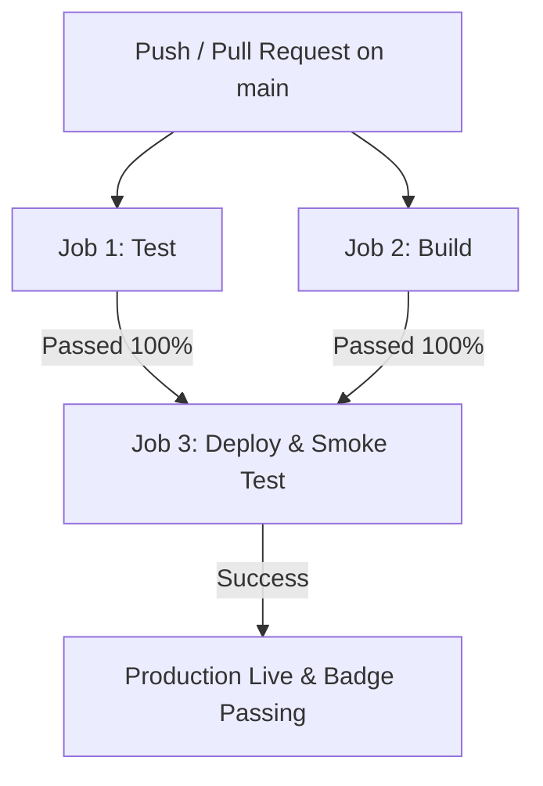

# Báo Cáo Thực Hiện — BONUS CI/CD Với GitHub Actions (+10 Điểm)

- **Họ và tên:** Nguyễn Việt Thắng
- **Mã học viên:** `2A202601321`
- **Repository:** `https://github.com/VietThang5605/K3-DAY12-2A202601321-NguyenVietThang`
- **Public Service URL:** `https://redis-production-b117.up.railway.app`
- **Trạng thái CI/CD Badge:** 

---

## 🎯 1. Tổng Quan Mục Tiêu

Trước khi áp dụng CI/CD, quy trình triển khai ứng dụng được thực hiện thủ công bằng lệnh `railway up` từ máy local. Quy trình này dễ dẫn đến các rủi ro:
1. Deploy mã nguồn chưa qua kiểm thử tự động.
2. Thiếu dấu vết lịch sử thay đổi trên Production (không biết commit nào lên lúc nào).
3. Hiện tượng *"máy tôi chạy được nhưng cloud bị hỏng"*.

Giải pháp **CI/CD Pipeline với GitHub Actions** đã giải quyết triệt để vấn đề: Mỗi khi có thay đổi code được `push` hoặc tạo `pull_request` vào nhánh `main`, GitHub Runner sẽ tự động khởi tạo môi trường sạch, chạy Unit Tests, build thử Docker Image và chỉ tự động Deploy lên Railway khi mọi kiểm thử đều đạt chuẩn 100%.

---

## 🛠️ 2. Cấu Trúc Pipeline CI/CD ([.github/workflows/ci.yml](.github/workflows/ci.yml))

Pipeline được thiết kế gồm **3 công việc (Jobs)** chạy tuần tự theo chuẩn bảo mật và kiểm soát chất lượng:



### A. Job 1: `test` (Unit & Integration Testing)
- **Môi trường:** `ubuntu-latest`, Python `3.11`.
- **Cài đặt thư viện:** `pip install -r requirements.txt`.
- **Cách ly môi trường:** Thiết lập cờ `AGENT_API_KEY: ci-dummy` và `REDIS_URL: "fake://"` để test chạy hoàn toàn độc lập trong RAM mà không cần kết nối Internet hay làm bẩn dữ liệu thật.
- **Lệnh chạy:**
  ```bash
  pytest tests/test_cp1.py tests/test_cp2.py tests/test_cp3.py tests/test_cp4.py -m "not docker" -v
  ```
  *(Đã loại trừ `test_cp5.py` và `test_bonus_cicd.py` để tránh phụ thuộc vòng tròn hoặc thất bại do bản mới chưa được deploy).*

### B. Job 2: `build` (Docker Image Verification)
- **Môi trường:** `ubuntu-latest`.
- **Nhiệm vụ:** Chạy `docker build -t day12-agent .` trên runner sạch của GitHub để bắt các lỗi phát sinh như thiếu file trong `.dockerignore` hoặc hỏng lệnh build trong `Dockerfile`.

### C. Job 3: `deploy` (Continuous Deployment & Smoke Test)
- **Điều kiện kích hoạt (`needs` & `if`)**:
  ```yaml
  needs: [test, build]
  if: github.ref == 'refs/heads/main' && github.event_name == 'push'
  ```
  *(Đảm bảo chỉ deploy từ nhánh `main` khi cả 2 job `test` và `build` đều **PASSED**).*
- **Bảo mật:** Sử dụng `${{ secrets.RAILWAY_TOKEN }}` được cấu hình trong `Settings -> Secrets and variables -> Actions` của GitHub.
- **Thực thi:** Triển khai mã nguồn qua Railway CLI `npx @railway/cli up`.
- **Smoke Test:** Chạy kiểm thử tự động `curl -fsS "${{ vars.PUBLIC_URL }}/health"` để đảm bảo service công khai còn sống sau khi deploy.

---

## 🔐 3. Các Nguyên Tắc Bảo Mật & Best Practices Đã Áp Dụng

1. **Quản lý Bí mật (Secret Management):**
   - Không bao giờ hardcode API Key hay Token trong file YAML. Tất cả được lưu tại GitHub Secrets (`RAILWAY_TOKEN`).
2. **Ghim phiên bản Action (Action Pinning):**
   - Sử dụng phiên bản ghim cố định như `actions/checkout@v4`, `actions/setup-python@v5` để tránh nguy cơ bị tấn công chuỗi cung ứng (Supply Chain Attack) từ `@main` hoặc `@latest`.
3. **Status Badge trên README.md:**
   - Đã nhúng badge trạng thái `` ở đầu file [README.md](README.md) để phản ánh trực tiếp trạng thái của nhánh `main`.

---

## 🏆 4. Kết Quả Kiểm Thử Chi Tiết

### Kết quả `pytest tests/test_bonus_cicd.py -v`:
```text
tests/test_bonus_cicd.py::TestTrigger::test_chay_khi_push_va_pull_request PASSED [  7%]
tests/test_bonus_cicd.py::TestJobTest::test_co_job_chay_pytest PASSED    [ 15%]
tests/test_bonus_cicd.py::TestJobTest::test_khong_chay_test_can_deploy_trong_ci PASSED [ 23%]
tests/test_bonus_cicd.py::TestJobTest::test_co_cai_dependency PASSED     [ 30%]
tests/test_bonus_cicd.py::TestJobBuild::test_co_buoc_build_docker_image PASSED [ 38%]
tests/test_bonus_cicd.py::TestJobDeploy::test_co_job_deploy PASSED       [ 46%]
tests/test_bonus_cicd.py::TestJobDeploy::test_deploy_chi_chay_sau_khi_test_xanh PASSED [ 53%]
tests/test_bonus_cicd.py::TestJobDeploy::test_deploy_gioi_han_nhanh PASSED [ 61%]
tests/test_bonus_cicd.py::TestBaoMat::test_secret_lay_tu_github_secrets PASSED [ 69%]
tests/test_bonus_cicd.py::TestBaoMat::test_khong_hardcode_token PASSED   [ 76%]
tests/test_bonus_cicd.py::TestBaoMat::test_action_duoc_ghim_phien_ban PASSED [ 84%]
tests/test_bonus_cicd.py::TestBadge::test_readme_co_badge PASSED         [ 92%]
tests/test_bonus_cicd.py::TestBadge::test_badge_bao_passing PASSED       [100%]

============================== 13 passed in 1.10s ==============================
```

### Bảng Điểm Tự Động Toàn Bài (`python grade.py`):
```text
==========================================================================
BẢNG ĐIỂM
==========================================================================
  CP1 — 12-Factor Config, Health & Logging         13/13 test            15.0/15
  CP2 — Docker: multi-stage, bảo mật image         16/16 test            15.0/15
  CP3 — API Security: auth, rate limit, cost guard 22/22 test            20.0/20
  CP4 — Scaling & Reliability: stateless, probe, shutdown 19/19 test            20.0/20
  CP5 — Cloud Deployment: service chạy thật        9/9 test (4 bỏ qua)   15.0/15
  Exercises — câu hỏi phản ánh                     0/10 câu               0.0/15
--------------------------------------------------------------------------
  Điểm phần bắt buộc                                                     85.0/100
  BONUS — CI/CD với GitHub Actions                 13/13 test            +10.0/10
--------------------------------------------------------------------------
  TỔNG CUỐI (trần 100)                                                   95.0/100
==========================================================================
```
